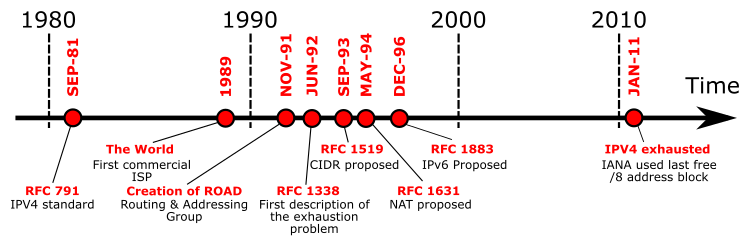

# IPv4、IPv5、IPv6：为什么IPv4不够用？为什么没有IPv5？

---

## 一、IPv4为什么不够用？

IPv4是1970年代末设计并投入使用的互联网协议第四版。它定义了IP地址的长度为32位，也就是每个IP地址是四组数字，比如 `192.168.1.1`。

- **32位地址空间总共能分配大约42亿（2³²）个IP地址。**
- 当时互联网规模很小，几十亿个地址绰绰有余。
- 随着互联网的爆炸式增长，尤其是物联网、移动设备的普及，地址很快就出现枯竭的风险。
- 很多地址被机构预留、分配不均，实际可用数量更少。

下面是一张示意图，展示了IPv4地址分配和枯竭的过程：

> 图：IPv4地址分配和消耗趋势（来源：[Wikipedia](https://en.wikipedia.org/wiki/IPv4_address_exhaustion)）

为缓解IPv4地址枯竭，人们采用了NAT（网络地址转换）、CIDR等技术，但治标不治本。互联网规模继续扩大，IPv4地址最终不够分配，严重限制了互联网发展。

---

## 二、为什么没有IPv5？

很多人以为IPv5被“跳过”了，其实IPv5并不是一个正式的、公开广泛使用的协议：

- IPv5其实是“ST协议”（Stream Protocol，流协议），协议号为5。
- 它是上世纪80年代实验性协议，主要用于语音、视频等流式数据传输的测试。
- IPv5依然使用32位地址，没有解决IPv4的根本问题（地址空间小）。
- 它从未成为正式的互联网主协议，也没有大规模部署。

示意图：IP协议版本分布历史  

> 图：IP协议栈及版本号分配（来源：[Wikipedia](https://en.wikipedia.org/wiki/Internet_Protocol_version_5)）

**由于协议号5被ST协议占用，后续制定新一代IP协议时，为了避免混淆，直接采用了IPv6这个“下一个编号”。**

- 参考资料：[Why There Is No IPv5 - Cloudflare Blog](https://www.cloudflare.com/learning/network-layer/why-there-is-no-ipv5/)
- 参考资料：[Internet Protocol version 5 - Wikipedia](https://en.wikipedia.org/wiki/Internet_Protocol_version_5)

---

## 三、IPv6是如何解决IPv4不足的？

IPv6（Internet Protocol version 6）是为了解决IPv4地址枯竭等问题而设计的下一代互联网协议。

- **IPv6采用128位地址，可提供约3.4×10³⁸个地址**，几乎“用不完”。
- 支持更高效的路由、更优的安全性、更适合新型网络需求。
- IPv6地址格式如：`2001:0db8:85a3:0000:0000:8a2e:0370:7334`。

IPv4与IPv6地址空间对比示意图：

> 图：IPv4和IPv6地址空间对比（来源：[Wikipedia](https://en.wikipedia.org/wiki/IPv6)）

各国、各大互联网公司都在推进IPv6普及，逐步替代IPv4。

- 参考资料：[What is IPv6? - Cloudflare](https://www.cloudflare.com/learning/network-layer/what-is-ipv6/)
- 参考资料：[IPv6 - Wikipedia](https://en.wikipedia.org/wiki/IPv6)

---

## 总结

- **IPv4**：诞生早、地址空间有限，已远远不够现代互联网使用。
- **IPv5**：仅是用于实验的“流协议”，没有成为主流或标准协议。
- **IPv6**：下一代互联网协议，解决了IPv4所有的核心问题，为互联网未来发展提供了坚实基础。

所以，你在现实中不会见到IPv5。IPv4与IPv6共同存在于当前互联网环境中，而IPv6是未来的主流方向。

---

## 更多参考链接

- [IPv4地址枯竭 - 维基百科](https://zh.wikipedia.org/wiki/IPv4%E5%9C%B0%E5%9D%80%E6%9E%81%E9%99%90)
- [Why There Is No IPv5 - Cloudflare](https://www.cloudflare.com/learning/network-layer/why-there-is-no-ipv5/)
- [IPv6 - 维基百科](https://zh.wikipedia.org/wiki/IPv6)
- [Internet Protocol version 5 - Wikipedia](https://en.wikipedia.org/wiki/Internet_Protocol_version_5)