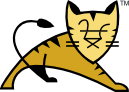

# tomcat是什么
tomcat是一个开源的Servlet容器和Web服务器，由Apache软件基金会开发和维护。它实现了Java EE的Servlet和JSP规范，广泛用于运行Java Web应用程序。

官网链接：https://tomcat.apache.org/

# tomcat的起名由来
Tomcat的名字来源于“Tomcat”，即雄性猫。这个名字的选择是因为Tomcat的创始人James Duncan Davidson希望给这个开源项目起一个与动物相关的名字，以符合许多开源项目的命名习惯。
# tomcat的内部组件
Tomcat的内部组件包括：
- **Catalina**：Tomcat的核心Servlet容器，负责处理HTTP请求和响应。
- **Coyote**：Tomcat的HTTP连接器，负责处理与客户端的网络连接。
- **Jasper**：Tomcat的JSP引擎，负责将JSP页面编译成Servlet。
- **Cluster**：Tomcat的集群组件，提供负载均衡和会话复制功能。
# tomcat的组件起名由来
- **Catalina**：这个名字来源于加利福尼亚州的Catalina岛，Tomcat的创始人James Duncan Davidson对这个地方有好感。Catalina也是一个与海洋相关的名字，符合Tomcat的主题。
- **Coyote**：这个名字来源于北美洲的一种野生动物，象征着Tomcat的灵活性和高效性。
- **Jasper**：这个名字来源于Tomcat的JSP引擎，Jasper是一个常见的宝石名称，象征着Tomcat的稳定性和可靠性。

# 参考链接
### https://askubuntu.com/questions/708094/why-did-apache-name-its-webservers-apache-and-tomcat
> Tomcat started off as a servlet reference implementation by James Duncan Davidson, a software architect at Sun Microsystems. He later helped make the project open source and played a key role in its donation by Sun Microsystems to the Apache Software Foundation. The Apache Ant software build automation tool was developed as a side-effect of the creation of Tomcat as an open source project.

> Davidson had initially hoped that the project would become open sourced and, since many open source projects had O'Reilly books associated with them featuring an animal on the cover, he wanted to name the project after an animal. He came up with Tomcat since he reasoned the animal represented something that could fend for itself. Although the tomcat was already in use for another O'Reilly title, his wish to see an animal cover eventually came true when O'Reilly published their Tomcat book with a snow leopard on the cover in 2003.

### https://www.quora.com/In-Apache-Tomcat-where-did-the-name-Catalina-come-from
> By Author of Tomcat -"James Duncan Davidson"...
"Using "Catalina" was my idea, because I wrote most of the original code that became it. The reasons are mundane, but here they are for the record:
> * Even though I don't live in Southern CA, I've always liked what I've read and seen of Catalina Island.
> * One of the towns on the island is Avalon, and we were (at the beginning) considering using the Avalon Framework (http://jakarta.apache.org/avalon/) for the internal architecture. It would have been a cute tie-in, but alas it didn't happen that way.
> * When I'm coding, I regularly have one or more cats wandering around my lap and adding to the whitespace when they don't think I put enough (you don't need fingers to press the space bar :-). Another "code name" you'll hear in the Tomcat world is Jasper -- that's the name of the JSP page compiler part of Tomcat. That name was carried over from even before my time, but I'm sure it probabbly came from the alliteration (JaSPer)." 